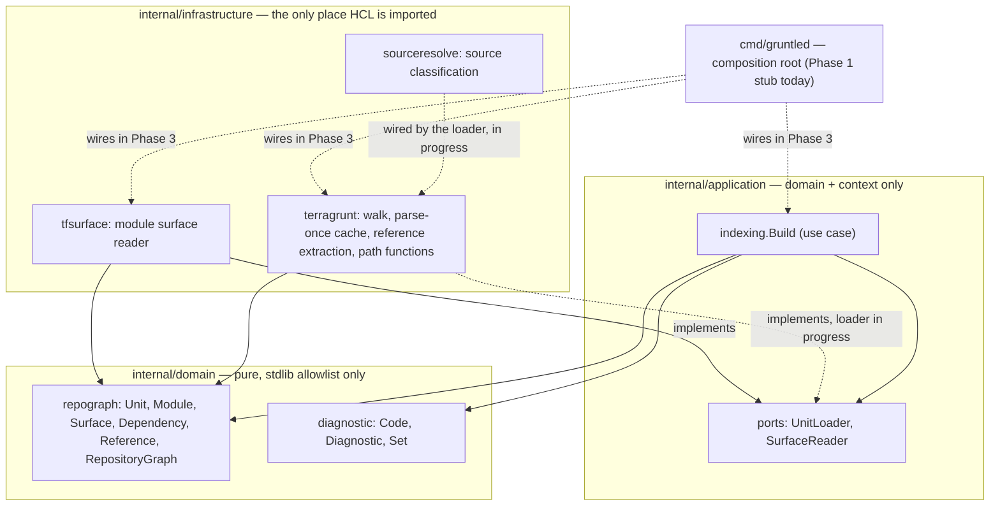
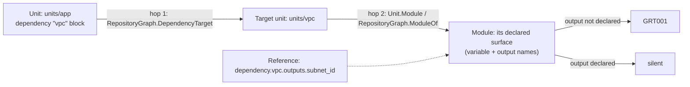

# gruntled

> *Terragrunt, but gruntled.*

[](https://github.com/GiulioSavini/gruntled/actions/workflows/ci.yml)

gruntled is a Go static analyzer for Terragrunt repositories. It parses your
units, `include` files and the `.tf` modules they call, builds a graph of how
everything is wired together, and tells you when a `dependency.X.outputs.Y`
reference points at an output that does not exist — before you run anything
slow.

**This project is mid-development.** The domain model, the parsing pipeline
and the architecture guardrails exist and are tested; the `gruntled check`
command line does not exist yet. See [Status](#status) below before you go
looking for a binary to run.

## The problem

In a Terragrunt repository of any real size, `dependency` blocks let one unit
read another module's outputs:

```hcl
# units/app/terragrunt.hcl
dependency "vpc" {
  config_path = "../vpc"
}

inputs = {
  subnet_id = dependency.vpc.outputs.subnet_id
}
```

Nothing checks that `subnet_id` is actually declared by the module `units/vpc`
resolves to. If someone renames it:

```hcl
# modules/vpc/outputs.tf
output "subnet_ids" {   # was "subnet_id"
  value = aws_subnet.this[*].id
}
```

`units/app/terragrunt.hcl` still says `dependency.vpc.outputs.subnet_id`, and
nothing tells you it's wrong until you run `terragrunt run-all plan` and wait.
Terragrunt documents this as an architectural property, not a bug: `include`
files are re-evaluated once per unit that includes them rather than parsed
and shared, so a `run_cmd` in a root config included by a hundred units runs
a hundred times, and `locals` evaluation is O(n²) across a stack. The
documented consequence is `run-all plan` taking 8+ minutes on 30-50 modules
([performance docs](https://terragrunt.gruntwork.io/docs/troubleshooting/performance),
[gruntwork-io/terragrunt#2806](https://github.com/gruntwork-io/terragrunt/issues/2806)).
You find out about the broken reference one error at a time, at the end of
that wait, then fix, then wait again.

Terragrunt's own attempt at catching this
([gruntwork-io/terragrunt#5811](https://github.com/gruntwork-io/terragrunt/issues/5811))
was closed in 2026: the fix makes `dependency.X.outputs.Y` evaluate to an
opaque unknown during validation instead of checking the output exists. The
gap is still open. `terragrunt hcl validate --inputs --strict` catches
missing required inputs and undeclared inputs, but not this.

## What gruntled does

- Reads `terragrunt.hcl` files, `include` blocks and `.tf` module files with
  its own structural HCL decoder — it never shells out to `terragrunt` or
  `tofu`, and never evaluates a Terraform expression to a value.
- Builds a graph of every unit, the module it resolves to, and that module's
  declared `variable` and `output` names.
- Resolves a `dependency.X.outputs.Y` reference through both hops (unit →
  target unit → target unit's module) and checks `Y` against that module's
  actual outputs.

## What gruntled deliberately does not do

- **No `terragrunt`/`tofu`/`tflint` execution.** Calling external binaries
  would break the single-binary, no-external-process guarantee that makes
  the air-gap and idempotency claims demonstrable instead of declared.
- **No network access at runtime.** No remote source downloading, no
  telemetry, no update checks. A unit with a remote `terraform.source` is
  classified as such without fetching it, and marked unknown.
- **No on-disk index cache**, deliberately deferred: schema versioning,
  invalidation and corruption are three sources of bugs, traded against an
  index that should build in under a second from a cold start.
- **No Terraform correctness checking** — provider schemas, resource
  attributes, expression evaluation. `.tf` files are read only to extract
  the module's public surface (variable and output names). That's
  `tflint`/`tofu validate`'s job.
- **No cloud credentials, ever.** gruntled never needs them, because it
  never plans or applies anything. It is strictly read-only.

## The zero-false-positive philosophy

Ten missed bugs are better than one wrong accusation. Whenever gruntled hits
a construct it cannot resolve statically — a dynamically computed
`config_path`, a remote module source, an HCL function this project has
deliberately never implemented because it would shell out or hit the
network — the affected unit or module is marked **unknown**, and analyzers
stay silent about it rather than guess. An unknown unit still shows up in the
graph; it just never produces a diagnostic. A single false positive is what
ends adoption of a tool like this, so the project treats it as strictly worse
than staying quiet.

## Status

v0.1 is being built as a falsifiable experiment, in four phases (see
[`.planning/ROADMAP.md`](.planning/ROADMAP.md)). Phase 1 is complete, Phase 2
is in progress, Phases 3 and 4 haven't started.

**Works today, tested:**
- The pure domain model (`internal/domain/repograph`, `internal/domain/diagnostic`):
  `Unit`, `Module`, `Surface`, `Dependency`, `Reference`, the
  `RepositoryGraph` aggregate, and `Diagnostic` with its `GRT001`/`GRT100`
  codes.
- The architecture-enforcement script and its CI job (see
  [Architecture](#architecture)).
- The deterministic synthetic Terragrunt repository generator
  (`internal/testsupport/synthrepo`), including deliberate mutation
  injection with an exact expected-diagnostics oracle.
- The `indexing.Build` application use case, tested against hand-written
  fakes (no filesystem, no HCL).
- Leaf infrastructure adapters, individually tested against real files:
  unit-directory discovery (`terragrunt.discoverUnits`), whole-body
  `dependency.X.outputs.Y` reference extraction with byte-accurate
  positions, a parse-once structural cache, the six pure Terragrunt path
  functions under closed evaluation, `terraform.source` classification
  (`sourceresolve.Classify`), and the module surface reader
  (`tfsurface.Reader`).

**In progress:** the Terragrunt loader that wires the pieces above into a
complete `ports.UnitLoader` — include merging, resolving a unit to its
module both via `terraform.source` and via the unit's own directory when
absent, and end-to-end two-hop resolution against a real repository on disk.

**Not built yet:**
- Any analyzer that actually emits `GRT001`/`GRT100` against a real
  repository, and the `mock_outputs` interaction rule for `GRT001`
  (Phase 3).
- The `gruntled check` CLI. `cmd/gruntled` currently only prints
  `gruntled: no commands implemented yet` and exits 1 — it's a Phase 1 stub
  that exists so `go build ./...` exercises the full module tree.
- The real-repository validation experiment: zero false positives and every
  injected mutation caught on a public Terragrunt corpus, faster than
  `terragrunt hcl validate` (Phase 4).
- Everything under "Later" in the roadmap: the `gruntled watch` daemon,
  `gruntled blast` (Broken vs Impacted), diagnostics `GRT002`-`GRT006`,
  `gruntled graph --json`, SARIF output.

### Planned interface (Phase 3)

Once `gruntled check` exists, per
[`.planning/REQUIREMENTS.md`](.planning/REQUIREMENTS.md) (CLI-01 through
CLI-05), it's a one-shot command that analyzes a repository and prints
diagnostics deterministically:

```console
$ gruntled check .
units/app/terragrunt.hcl:8:15: GRT001: dependency.vpc.outputs.subnet_id: module units/vpc has no output "subnet_id"
$ echo $?
<non-zero, exact codes not yet documented — CLI-02>
```

This does not run today. It's derived from the requirements document to show
the shape of the eventual output (CLI-01 through CLI-05: human-readable
diagnostics, a documented non-zero exit code on error, byte-identical output
for identical input, no network calls or external processes, nothing written
inside the analyzed repository), not a claim about current behavior.

## Architecture

gruntled follows DDD/hexagonal layering: a pure domain at the center, an
application layer that depends only on the domain and declares ports,
infrastructure adapters that implement those ports, and a composition root
that wires adapters to ports. HCL parsing (`hashicorp/hcl/v2`,
`zclconf/go-cty`) is confined to `internal/infrastructure` — the domain and
application layers never import it, and never do filesystem I/O.



This isn't aspirational: it's enforced on every push and PR by
[`scripts/check-architecture.sh`](scripts/check-architecture.sh), run as its
own `architecture` job in CI, separate from the `check` job. The script
fails the build if any of these hold:

- **compile gate** — domain, application or `cmd` doesn't compile (every
  other rule depends on `go list` succeeding).
- **domain-stdlib-allowlist** — `internal/domain` imports anything outside a
  fixed list of pure standard-library packages (`errors`, `strings`,
  `strconv`, `sort`, `slices`, `maps`, `path`, `cmp`, `iter`, `bytes`,
  `math`, `math/bits`, `unicode`/`utf8`/`utf16`; `testing`/`reflect` in test
  files only). `fmt` is deliberately excluded — the domain builds error
  messages with `errors`/`strconv` alone, so nothing in it can reach
  stdout/stderr.
- **application-stdlib-allowlist** — same allowlist plus `context`, for
  cancellation.
- **platform-neutral** — no build-constrained files, no cgo, no assembly in
  domain or application: a `foo_windows.go` would be invisible to `go list`
  on Linux and could smuggle in an import unseen.
- **domain-external-deps** / **application-external-deps** — the *transitive*
  dependency graph of these layers must never reach HCL, the filesystem, or
  any other internal layer, closing the loophole where an allowed import
  quietly pulls in a disallowed one two levels down.
- **binary-links-testsupport** — the shipped `cmd/gruntled` binary must never
  link `internal/testsupport` (the synthetic repo generator).
- **hcl-only-in-infrastructure** — `hashicorp/hcl` and `zclconf/go-cty` may
  only be imported directly inside `internal/infrastructure`.
- Two **non-vacuous guards** run first, so an accidentally-empty
  `internal/domain` or `internal/application` fails loudly instead of every
  rule below it passing by matching nothing.

Every rule is proven capable of actually failing by
[`scripts/test-check-architecture.sh`](scripts/test-check-architecture.sh),
which plants a violation of each rule in a throwaway copy of the tree and
asserts the checker catches it — a passing architecture check that can never
fail is worth nothing.

## The two-hop resolution

A `dependency` block only tells you which *unit* it points at — not which
module runs there, because a unit's module can live in a different
directory (`terraform.source`) or, absent that attribute, be the unit's own
directory. Answering "does `dependency.vpc.outputs.subnet_id` exist" needs
two hops:



In code, `RepositoryGraph.DependencyTarget(unit, dep)` resolves hop 1 and
`RepositoryGraph.ModuleOf(unit)` (or `Unit.Module()`) resolves hop 2, both in
`internal/domain/repograph/graph.go`. Neither hop guesses: `Dependency.Target()`
and `Unit.Module()` both return `(value, false)` rather than a zero value when
the thing they'd point at isn't known, so a caller has to handle "unresolved"
explicitly instead of silently walking a zero path.

## How units, modules and sources get resolved

- **Unit discovery** walks the repository with `fs.WalkDir`
  (`terragrunt.discoverUnits`), treating any directory that directly
  contains `terragrunt.hcl` or `terragrunt.hcl.json` as a unit. It never
  descends into `.git`, `.terraform`, `.terragrunt-cache` or `vendor`, and
  never follows or counts a symlinked directory or a symlinked
  `terragrunt.hcl`. `.terragrunt-stack` *is* walked on purpose: once
  `terragrunt stack generate` materializes its units as ordinary
  `terragrunt.hcl` files, the walk finds them like any other unit; only an
  ungenerated stack definition is invisible, which is a documented absence
  rather than a misreport.
- **Local sources and `//` subdirs**: `sourceresolve.Classify` is a pure,
  I/O-free port of Terragrunt's own source-detector chain — forced-getter
  prefixes (`git::`, `s3::`, ...), URL schemes, and host shorthands
  (`github.com/`, `gitlab.com/`, `bitbucket.org/`, an SCP-like prefix, or a
  string containing `amazonaws.com/`/`googleapis.com/`) classify as remote;
  everything else that isn't otherwise invalid classifies as local. This
  matches Terragrunt's own detector chain, where a bare `units/chicken` is
  local, unlike plain Terraform. A local source is split at its first `//`
  into `Root` and `Subdir`, mirroring Terragrunt's own module-subdirectory
  convention. `sourceresolve.Classify` is tested in isolation today; wiring
  it into the loader so a unit's `terraform.source` actually gets classified
  end-to-end is part of the in-progress loader work.
- **Includes**: `include.path`, `dependency.config_path` and
  `terraform.source` are the only expressions gruntled ever evaluates, and
  only inside a closed `hcl.EvalContext` with no variables and exactly the
  six pure Terragrunt path functions (`find_in_parent_folders`,
  `path_relative_to_include`, `path_relative_from_include`,
  `get_terragrunt_dir`, `get_parent_terragrunt_dir`,
  `get_original_terragrunt_dir`). Those functions resolve against a virtual
  sentinel root path rather than a real filesystem path, so no
  checkout-specific absolute path can ever leak into a diagnostic. Every
  file `terragrunt.fileCache` parses is decoded structurally exactly once —
  `include`, `terraform`, `dependency` and `generate` blocks are captured as
  unevaluated `hcl.Expression` values — so a shared include file used by a
  hundred units is read from disk once, not a hundred times. Merging an
  included file's facts into every unit that includes it is the remaining
  piece of the loader (Plan 02-05, in progress).
- **Symlinks** are read through an `fs.FS` backed by `os.Root`: an in-repo
  file symlink (the primary validation corpus symlinks a shared `global.tf`
  into every module directory) is followed and its declarations included,
  while an escaping or dangling symlink is refused by `os.Root` itself and
  turns that module's surface unknown (`module-file-unreadable`) instead of
  crashing or silently under-reporting the module's outputs.

## Diagnostic codes

A `Code` is always `"GRT"` followed by exactly three ASCII digits
(`internal/domain/diagnostic/diagnostic.go`, `Code.Valid()`). Two are defined
in code today:

| Code | Constant | Meaning |
|---|---|---|
| `GRT001` | `CodeUnknownOutput` | A `dependency.X.outputs.Y` reference names an output the target module does not declare. |
| `GRT100` | `CodeSyntaxError` | The HCL being analyzed is invalid. |

Neither is emitted end-to-end against a real repository yet (see
[Status](#status)) — the `Diagnostic` type and its ordering (`Compare`,
`Key`, `Set`) exist and are tested; the analyzer that produces `GRT001`
findings from a `RepositoryGraph` is Phase 3.

`GRT002` through `GRT006` are named and scoped in the design document and the
roadmap's "Later" section (`config_path` pointing nowhere, dependency
cycles, a removed-but-still-referenced output, an `inputs` key with no
matching `variable`, an unset `variable` with no default) but have no `Code`
constant yet — they're deferred past v0.1.

## Determinism guarantees

Same input produces the same diagnostics, in the same order, with the same
exit code, every time — this is load-bearing for CI and pre-commit use, and
for the golden tests Phase 4 depends on:

- `RepositoryGraph` sorts and defensively clones its units and modules at
  construction time, so any input order produces an identical graph
  (`NewRepositoryGraph`, `internal/domain/repograph/graph.go`).
- `Diagnostic.Compare` orders findings by position, then code, then unit,
  then severity, then message — unit is part of the order specifically
  because a reference written in a shared include file is evaluated once
  per including unit, and without it two diagnostics differing only in unit
  would sort unstably.
- Every path in a diagnostic or position is repository-relative
  (`repograph.RepoPath`); the six path functions resolve against a virtual
  root sentinel instead of a real filesystem path, so an absolute path from
  the machine running gruntled can't leak into output and break
  reproducibility across checkouts or machines.
- `synthrepo.Render`/`Generate` are themselves deterministic: given the same
  `Spec` (unit count, include depth, dependency fanout, seed), they use
  `math/rand/v2`'s PCG with a documented, fixed draw order to produce a
  byte-identical tree on every run.

## The synthetic repository generator

`internal/testsupport/synthrepo` generates Terragrunt repository trees to
test against, instead of relying on hand-written fixtures or scarce
naturally-occurring bugs (real corpora don't have organic wiring bugs —
`apply` catches them before they're committed). Given a `Spec` — unit count,
include-nesting depth, dependency fanout, a seed — `Render`/`Generate`
deterministically produce a tree of `unit-NNN/terragrunt.hcl` +
`unit-NNN/main.tf` directories sharing one `root.hcl`, with an acyclic
dependency graph built by construction (unit *i* may only depend on units
with a lower index). `Spec.Errors` can inject a `BadOutputRef` mutation —
rewriting one reference's output name to one the target doesn't declare —
and `Render` returns a `Manifest` listing exactly the diagnostics a correct
analyzer must reproduce against the mutated tree: an exact oracle, not an
approximate one. This generator is the test substrate for Phases 2 through
4; it lives outside `internal/domain`/`internal/application`/
`internal/infrastructure` on purpose, and `binary-links-testsupport`
enforces that `cmd/gruntled` never links it into the shipped binary.

## Building, testing and checking locally

Requires the Go version pinned in `go.mod` (currently `go 1.27`; CI sets
`GOTOOLCHAIN=local` to build with exactly that version rather than silently
switching toolchains).

```console
go build ./...
go vet ./...
go test -race -count=1 ./...
gofmt -l .                    # must print nothing
go mod tidy -diff
go run honnef.co/go/tools/cmd/staticcheck@v0.8.1 ./...
go run golang.org/x/vuln/cmd/govulncheck@v1.8.0 ./...
bash scripts/check-architecture.sh
bash scripts/test-check-architecture.sh
```

## CI

[`.github/workflows/ci.yml`](.github/workflows/ci.yml) runs on every push to
`master` and every pull request, as two independent jobs:

- **`check`**: `gofmt` (fails on any unformatted file), `go mod tidy -diff`,
  `go vet`, `staticcheck`, `govulncheck`, `go test -race -count=1 ./...`,
  then a cross-build of `./cmd/gruntled` for `linux/amd64`, `linux/arm64`,
  `darwin/amd64`, `darwin/arm64` and `windows/amd64`.
- **`architecture`**: `scripts/check-architecture.sh` followed by
  `scripts/test-check-architecture.sh`.

## Further reading

- [`docs/superpowers/specs/2026-09-01-gruntled-design.md`](docs/superpowers/specs/2026-09-01-gruntled-design.md) —
  the full design rationale, including the survey of existing tools. Written
  in Italian as an internal document; user-facing artifacts (README, CLI
  output, diagnostic text) are English.
- [`.planning/PROJECT.md`](.planning/PROJECT.md) — problem statement, scope,
  constraints and key decisions.
- [`.planning/REQUIREMENTS.md`](.planning/REQUIREMENTS.md) — the numbered
  v1/v2 requirements this README's Status section is derived from.
- [`.planning/ROADMAP.md`](.planning/ROADMAP.md) — the four phases and their
  success criteria.

## License

`.planning/PROJECT.md` records Apache-2.0 as the intended license, matching
OpenTofu and Terragrunt, but no `LICENSE` file has been added to this
repository yet.
